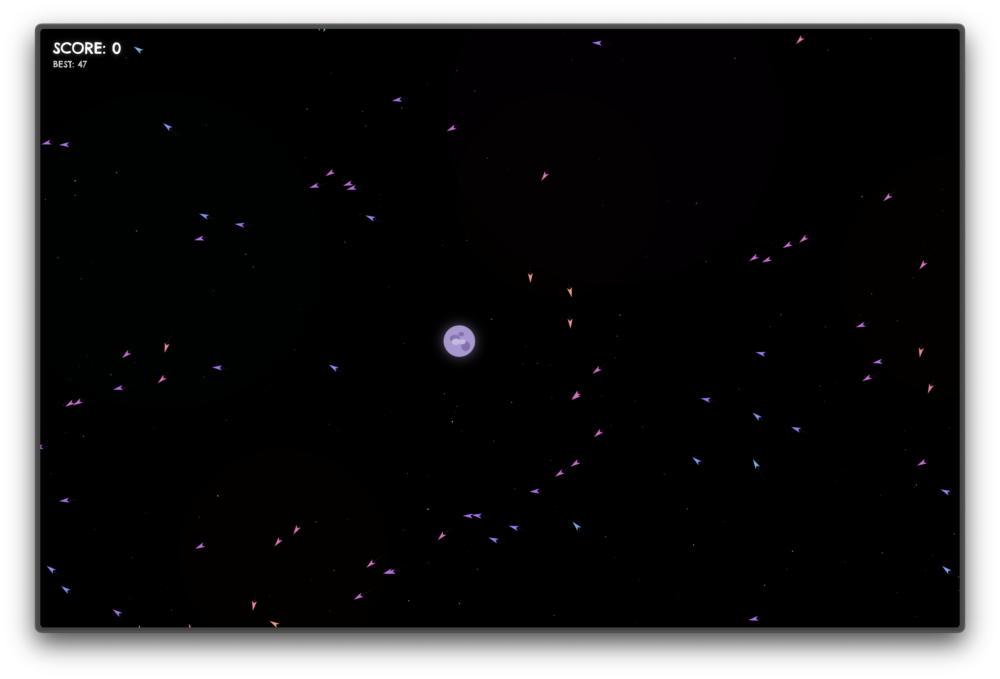

# pluto-rapid

Mini webgame built using [p5.js](https://p5js.org/).
Based on Daniel Shiffman's [The Nature of Code](https://natureofcode.com/).

Guide **Pluto** with your mouse through a continuously evolving flow field while dodging **vekts**. Score increases the longer you survive. The flow field morphs in real time, vekts get faster, and Pluto shrinks — the pressure mounts.

### Controls

| Key | Action |
|---|---|
| Mouse | Move Pluto |
| `ENTER` | Start game |
| `ESC` | Pause / Resume |
| `SPACE` | Toggle flow field debug view |

### Play

[rapid.kajnekvasil.com](https://rapid.kajnekvasil.com)
